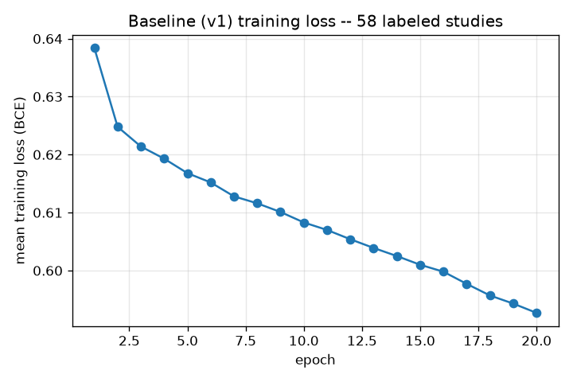
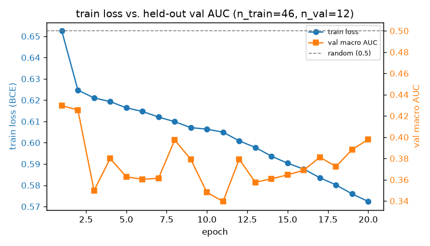
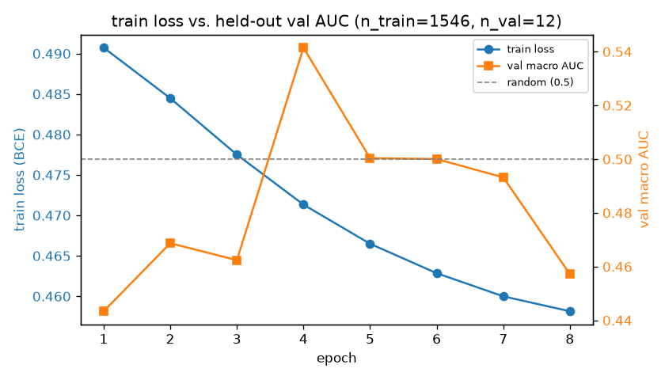
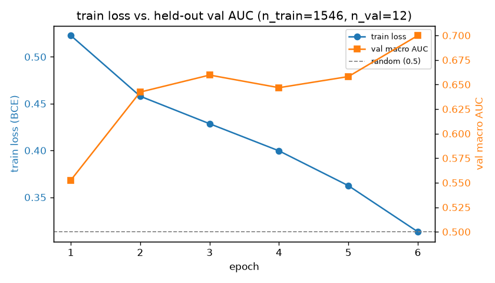
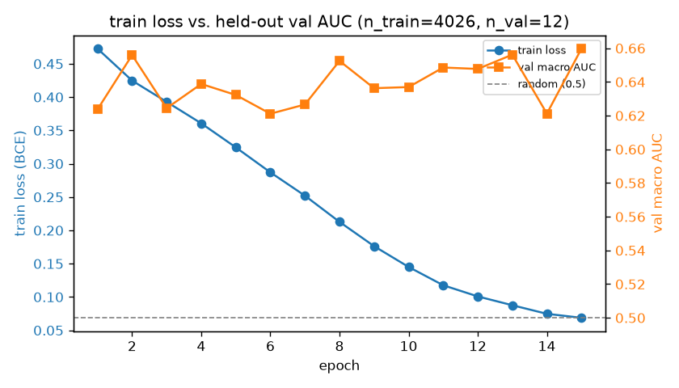
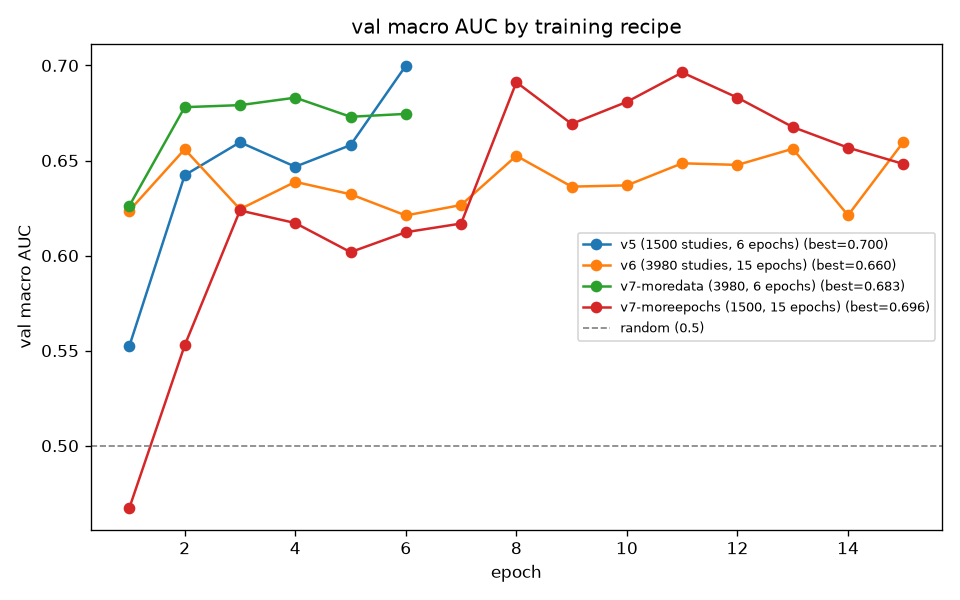
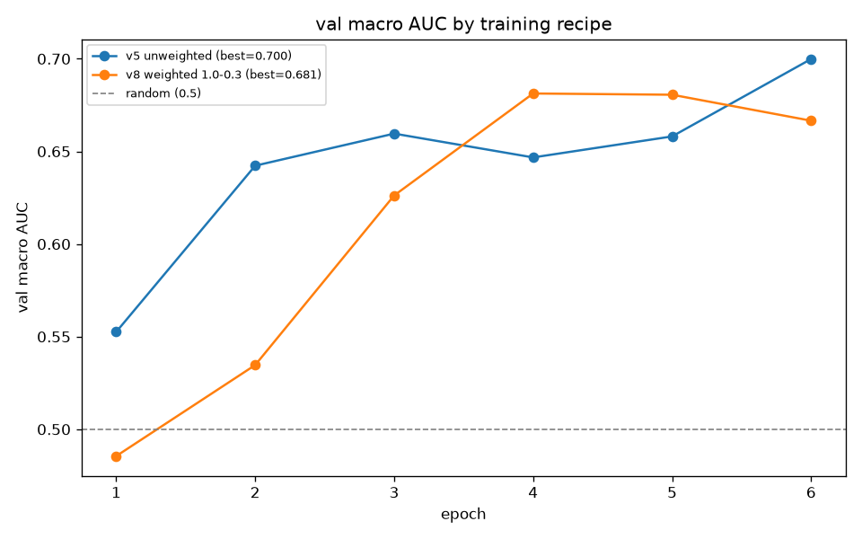
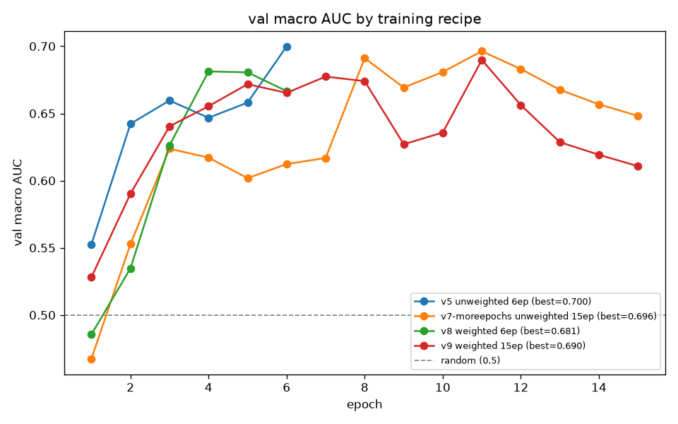
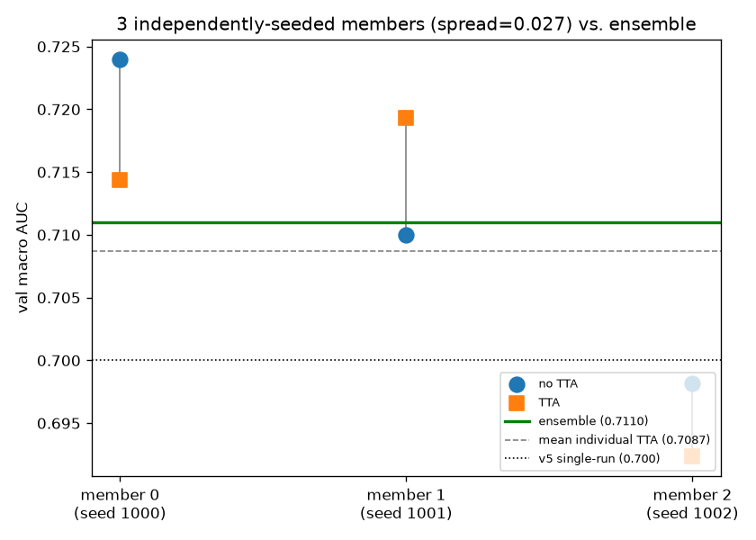

# RSNA Knee Abnormality Detection

Learning project + submission for the Kaggle competition
[RSNA Knee Abnormality Detection](https://www.kaggle.com/competitions/rsna-knee-abnormality-detection).

Goal: understand how a real multimodal medical-imaging ML pipeline is built (DICOM
handling, weak/report-derived labels, multi-series aggregation, CNN/transformer
backbones, evaluation), not primarily to win prizes.

## Task

Predict 12 per-study probabilities from knee MRI DICOM series + the free-text
radiology report:

`ACL, MCL, Medial Meniscus, Lateral Meniscus, Medial OA, Lateral OA, PF OA,
Effusion, Synovitis, Baker's, Contusion, Fracture`

Metric: macro-averaged ROC AUC across the 12 labels.

## Why the workflow looks like this

The dataset is ~570 GB of DICOMs, and this machine has no GPU. So the split is:

- **Kaggle Notebooks** (browser, free GPU quota, data pre-mounted): where actual
  EDA-on-full-data, training, and submission notebooks run.
- **This repo (local, synced to GitHub)**: source of truth for code — notebooks
  get exported/downloaded from Kaggle and committed here, reusable code lives in
  `src/`, and this README/`notes/` track what we tried and learned.

## Layout

- `notebooks/` — exported Kaggle notebooks (EDA, baseline, experiments) and
  `reference-notes.md`, a distilled write-up of a public top-scoring solution
  used as a rough roadmap
- `src/` — reusable Python modules (DICOM reading, dataset, model, EDA,
  log-plotting) — the "clean" version of the code, used for local dev/testing
- `kernels/<name>/` — self-contained scripts actually pushed to Kaggle to run
  with GPU + the full competition data mounted (`kaggle kernels push`); each
  is functionally the same code as `src/`, just inlined into one file
- `results/<name>/` — committed outputs from a kernel run (loss curve plots,
  example predictions) so progress is visible without re-running anything
- `data/` — small local artifacts only (e.g. `train.csv`, `train_series.csv`
  metadata pulled via the Kaggle API); actual DICOMs are NOT stored here
  (gitignored, too large — work with them inside Kaggle Notebooks)

## Setup (local)

```
pip install -r requirements.txt
# Kaggle API token saved to ~/.kaggle/access_token (not part of this repo)
kaggle competitions download -c rsna-knee-abnormality-detection -f train.csv -p data/
kaggle competitions download -c rsna-knee-abnormality-detection -f train_series.csv -p data/
python src/eda.py
```

## Status (2026-08-09)

Repo scaffolded, Kaggle API working, metadata pulled locally. First real numbers:

- 4,407 training studies, only **58** carry the 12 expert labels — the rest have
  only the free-text report. This is the central problem to solve (see
  `notebooks/reference-notes.md`).
- 24,371 series total, ~5.5 series per study on average.
- Label prevalence among the 58 labeled studies is fairly balanced (roughly
  15-60% positive per label, Effusion most common, MCL least common) — no
  extreme class imbalance to fight there, at least on this tiny labeled slice.

Next: build the smallest possible end-to-end pipeline (train on the 58 labeled
studies only, one series per study, simple CNN) to get a real `submission.csv`
out the door, before touching label extraction from reports or fancier models.

## Results

### v1 — baseline MIL model, 58 labeled studies only

A from-scratch CNN (no pretrained weights), multi-instance-learning over up to
3 series/study, trained for 20 epochs on just the 58 expert-labeled studies.
Goal for v1 was purely "does the whole pipeline run end to end and produce a
valid submission" — not a competitive score.



Training loss falls steadily (0.638 → 0.593) and hadn't plateaued yet at
epoch 20 — the run was mechanically healthy. But a closer look at the
predictions (`results/v1/submission_example.csv`) shows what that loss number
doesn't: the model's *average* predicted probability per label correlates
**0.95** with that label's raw prevalence in the 58 training studies. In other
words, at this stage it has mostly learned "guess close to the training
average for each label," not yet real per-image visual signal — expected and
diagnosable with only 58 training examples, a from-scratch backbone, and no
held-out validation yet to even measure real generalization. That gap is
exactly what the next steps (validation split, more training data via
report-derived labels, a pretrained backbone) are meant to close.

### v2 — held-out validation

Same model, but an honest 80/20 train/val split (46/12 studies) instead of
training loss as the only signal, with per-label ROC AUC computed on the
held-out 12 (labels with only one class present in that tiny split are
skipped rather than silently scored as a meaningless 0.5/undefined AUC).

### v3 — caching + a real GPU

v2 ran at ~90s/epoch. Two fixes, both driven by profiling that number rather
than guessing:

- **In-memory tensor caching.** v1/v2 re-decoded every study's DICOMs from
  scratch on *every* epoch, even though the images never change between
  epochs. Measured locally: ~2.4s to decode one study cold, <0.001ms to read
  it back from an in-memory cache after that — decoding was almost certainly
  the actual bottleneck, not the (tiny) model itself.
- **A GPU that's actually used.** `enable_gpu: true` got us a P100, but its
  compute capability (sm_60) isn't supported by the CUDA kernels in Kaggle's
  pre-installed PyTorch build, so v1/v2 silently fell back to CPU *while
  still burning P100 quota hours for nothing*. v3 installs an older
  torch+cu121 build (`torch==2.3.1`, still ships sm_60 kernels) before torch
  is ever imported. Confirmed working: `torch_version: "2.3.1+cu121"`,
  `device: "cuda"` in `results/v3/history_v3.json`. (Needs internet enabled
  for this dev/training kernel specifically — never for the eventual
  no-internet submission notebook.)

Concrete result: v3 finished its full 20-epoch run *before v2 did*, on the
same P100 class of hardware v2 had silently downgraded away from.



This plot is the real payoff of adding validation in v2: it's a textbook
overfitting curve. Training loss falls smoothly the entire time (0.652 →
0.572), while held-out validation AUC never crosses the 0.5 random-guess
line and shows no upward trend, drifting noisily between roughly 0.34 and
0.43. The model is getting better at fitting the 46 training studies and
*not* better at generalizing to studies it hasn't seen — exactly what you'd
expect from a from-scratch CNN with no pretrained features and only 46
training examples for a 12-label problem. Per-label AUC on the final epoch
swings wildly (`PF OA` 0.69, `Medial OA` 0.09) which is itself informative:
with only ~12 validation studies, per-label AUC is estimated from a handful
of examples and is far too noisy to read individual numbers as meaningful —
only the aggregate pattern (consistently at/below 0.5, no trend) is.

This is the concrete, measured case for the next two planned steps: more
training data (report-derived labels for the other 4,349 studies) and a
pretrained backbone, in that order — a from-scratch CNN on 46 examples
structurally cannot generalize much better than this, no matter how long
it trains.

### Report-derived labels (v1) — validated before trusting

4,349 of the 4,407 studies have no expert label, only a free-text report
(Spanish, French, English, and others — `kernels/extract_labels_v1/extract.py`
found that `train.csv` is **latin-1 encoded, not UTF-8**; reading it with
pandas' default silently mangled every accented character in that column
instead of raising). `notebooks/reference-notes.md`'s top-scoring public
solution used a large LLM to turn those reports into labels; the same idea
here, sized to what actually runs on Kaggle's free GPU: `Qwen/Qwen2.5-3B-Instruct`,
batched, greedy-decoded, with a hand-written prompt covering all 12
findings' clinical definitions (broadened Synovitis to include Hoffa fat
pad impingement/plica syndrome, effusion counts as present even at "trace"
amounts, Contusion requires a described traumatic pattern rather than
ordinary degenerative marrow edema, Fracture includes avulsion/insufficiency
fractures).

Same rule as the reference solution: never trust an extraction prompt on
the unlabeled studies before checking it against the studies that *do* have
real labels. `kernels/extract_labels_v1` runs the extractor on only the 58
gold-labeled studies and scores it against their real labels first:

- **75.9% mean accuracy, 0.64 mean F1** across the 12 labels
  (`results/extract_labels_v1/validation_report.json`) — smaller than the
  reference solution's 35B-model result (83.3%), which tracks with using a
  ~10x smaller, free-to-run model.
- 11 of 12 labels clearly beat the naive "always predict the majority
  class" baseline — real signal, not noise. The one exception is MCL
  (81.0% vs. an 84.5% majority baseline: MCL is rare enough in this sample
  that always guessing "no MCL injury" edges out the model on raw accuracy,
  though its 0.52 F1 shows it is finding real positives, just with a
  costly false-positive rate).
- ~10% of the 58 reports didn't come back as valid JSON and were
  conservatively defaulted to all-negative rather than silently guessed.

Good enough to trust as a *weaker, soft* label source for the 4,349
unlabeled studies — not as good as the 58 real expert labels, but a real
step up from training on 46 studies alone. `kernels/extract_labels_v1_full`
runs the same, already-validated prompt over those 4,349 studies.

That full run finished after ~4.7h at a steady ~0.24 studies/s (batched
generation, 3B model on a P100): **4,349/4,349 studies processed, 369
(8.5%) parse failures** — consistent with the 58-study validation run's
~10%, so the failure rate isn't an artifact of the smaller sample. 3,980
studies came back with usable extracted labels, feeding directly into
`kernels/train_v4` capped at 1,500 of them (see above for why not all
3,980). One real gap found running this at full scale: the script only
writes its output CSV once, after all 4,349 studies are done, rather than
checkpointing incrementally — a run killed by Kaggle's session time limit
partway through would have lost everything rather than a partial result.
Worth fixing before running anything this long again.

### v4 — same model, 34x more training studies

46 gold + 1,500 extracted-label studies (1,546 total) vs. v3's 46 alone,
same from-scratch CNN, validated on the same 12 held-out gold studies.
Cost some real debugging first: the first attempt failed outright
(`enable_internet` was accidentally left `false`, blocking the same
torch/P100 install v3 needs); the second died silently ~38 minutes in with
no traceback, and the third died again at a different point with the same
no-traceback pattern — both consistent with an out-of-space/OOM kill from
the disk-backed tensor cache (a guessed, unconfirmed `/kaggle/temp/...`
path, uncompressed `.npz` files, no ceiling on writes). Fixed by moving the
cache to `tempfile.gettempdir()`, switching to `np.savez_compressed`,
disabling further cache writes once free disk drops below 3 GB instead of
crashing, and wrapping each study's training step in try/except so one bad
study can't take an hours-long run down with it. Also found and fixed,
separately: a single DICOM in the larger corpus had corrupted pixel data
and crashed `read_series` outright — v1-v3 never hit this because they only
ever touched the 58 gold studies' DICOMs.



With that fixed, the run itself: **best val macro AUC 0.541 at epoch 4**
(vs. v3's best of 0.430, and v3 never once crossed the 0.5 random line).
Real, if modest, improvement — but not a clean one. The curve peaks at
epoch 4 and drifts back down to 0.457 by epoch 8, and per-label AUC at the
final epoch is all over the place (`Medial OA` 0.66, `Effusion` 0.19).
Given only 12 validation studies, individual epoch-to-epoch and per-label
swings are still mostly noise (see v3's writeup) — the one thing worth
reading here is the aggregate level: v4 hovers *around* 0.5 instead of
*below* it like v3 consistently did, which is a real if modest signal that
more data helps, but 34x more data still isn't enough to fix a
from-scratch CNN's fundamental problem. That's exactly the case for
DINOv2 (v5, next): a pretrained backbone is a different lever than more
data, not a substitute for it, and the plan is both, not one instead of
the other.

### v5 — DINOv2 backbone + geometric slice order + laterality normalization

Identical data to v4 (same 46 gold + 1,500 extracted training studies, same
12 held-out gold validation studies, same everything except the model) so
the comparison isolates what changed: a pretrained `facebook/dinov2-small`
backbone (only the last 6 transformer blocks + final layernorm trainable,
at a 100x lower learning rate than the head) instead of v1-v4's
from-scratch CNN, plus two data-quality fixes carried over from analysing
two ~0.9-scoring public solutions — true geometric slice ordering
(patient-space position, not `InstanceNumber`) and laterality
normalization (every study mirrored onto a left-knee convention).



**Best val macro AUC: 0.700 at epoch 6** — up from v4's 0.541 and v3's
0.430, and this time the curve is the clean, healthy shape that's been
missing every run before this one: training loss falls smoothly *and* the
held-out AUC climbs alongside it, ending at its best value on the very
last epoch rather than peaking early and drifting back down. That last
part matters: it means this run stopped before it was done improving, not
because it plateaued — more epochs is a real, cheap next lever, separate
from anything architectural.

Per-label AUC at the final epoch: `MCL` 0.93, `PF OA` 0.91, `Baker's`
0.90, `ACL` 0.81 are strong; `Medial OA` 0.66, `Effusion` 0.63, `Synovitis`
0.59 are respectable; `Medial Meniscus` 0.51, `Lateral Meniscus` 0.56,
`Contusion` 0.50 are near chance. As with every per-label number in this
project so far, 12 validation studies makes any single label noisy — but
the aggregate jump from v4 is large enough (0.541 → 0.700) that it isn't
explained by that noise alone.

This is the first run in the project where the two things the README has
been tracking since v1 — training loss and held-out generalization — moved
together instead of diverging. Concretely confirms the diagnosis made back
in v3: the from-scratch CNN's problem was never "not enough data," it was
"no prior visual knowledge to build on."

### v6 — scaling v5 up made it worse, not better

The obvious next move: all ~3,980 usable extracted-label studies instead
of v5's 1,500, and 15 epochs instead of 6 (v5's curve was still climbing).
Both changed at once, which is a departure from every other step in this
project — and turned out to be exactly why the result is hard to read
cleanly.



**Best val macro AUC: 0.660 at epoch 15 — below v5's 0.700, not above it.**
Train loss falls dramatically and smoothly the whole run (0.473 → 0.069,
far lower than v5 ever reached), while held-out AUC just oscillates in a
0.62–0.66 band with no real trend — the overfitting pattern from v1-v4 is
back, just in a new form: not from too little data, but from too many
gradient updates (4,026 studies × 15 epochs ≈ 60k study-updates vs. v5's
1,546 × 6 ≈ 9k) over labels that are only ~76% accurate to begin with. The
mechanism this points at: the more the trainable last 6 transformer blocks
get updated against noisy pseudo-labels, the more they drift toward
fitting that noise specifically, rather than the real signal the 12 gold
validation studies are measuring.

The honest caveat: **two things changed at once here (data volume and
epoch count), so this result alone can't say which one caused the
regression, or whether it's their combination.** Every other step in this
project changed one variable at a time on purpose, specifically to avoid
this ambiguity — v6 didn't, and this is the result. A real gap this run
also exposed: `model_v6.pt` saves whatever epoch the run *ends* on, not
the epoch with the best validation AUC — harmless in v5 and v6 by
coincidence (both runs' last epoch happened to also be their best), but
not something to keep relying on by luck.

Next, to actually answer "was it the data or the epochs": rerun with only
one of the two changes at a time — v5's 6 epochs but the full ~3,980
studies, or v5's 1,500 studies but 15 epochs — plus save the
best-val-AUC checkpoint instead of the last one. Not done yet; a
deliberate stopping point to write up what v6 actually showed before
spending more compute chasing it.

### v7 — isolating v6's regression: it's mostly the data, and it compounds

Two reruns, otherwise identical code, each changing exactly one of v6's
two variables back to v5's setting:

| Run | Studies | Epochs | Best val macro AUC | Best epoch |
|---|---|---|---|---|
| v5 | 1,500 | 6 | **0.700** | 6 (still climbing) |
| v7-moredata | 3,980 | 6 | 0.683 | 4 |
| v7-moreepochs | 1,500 | 15 | 0.696 | 11 |
| v6 (both changed) | 3,980 | 15 | 0.660 | 15 |



**More epochs alone barely moved the needle** (0.696 vs. v5's 0.700 — well
within the noise 12 validation studies produce) **but more data alone did
measurably hurt** (0.683, a real ~0.017 drop, peaking early at epoch 4
then flattening rather than climbing like v5 did). And critically,
**v6's combined drop (0.660) is worse than either change on its own** —
worse than simply adding the two individual effects would predict. The
two hurt each other: more epochs gives the model more gradient steps to
fit the larger pool of noisy pseudo-labels (only ~76% accurate, see the
extraction section above) specifically, rather than the real signal the
46 gold-labeled training studies carry.

The actionable read: **the extracted labels are a real but limited
resource, not a free scaling lever.** Pouring in more of them and training
longer doesn't compound the way clean labeled data would — past some
point it teaches the model the extraction errors instead of the
underlying findings. v5's original, more conservative settings (1,500
studies, 6 epochs) remain the best recipe found in this project so far.

### v8 — loss-weighting gold vs. extracted labels: slower, not worse

The direct response to v7's finding: weight each study's loss by its label
source instead of trusting a gold-labeled and an extracted-label study
equally — gold studies at 1.0, extracted at 0.3, otherwise v5's exact
settings (1,500 studies, 6 epochs).



**Best val macro AUC 0.681 at epoch 4 — below v5's 0.700, not above it**,
but the curve shape tells a more specific story than "this didn't work."
v8 starts *slower* than v5 (0.486 vs. 0.553 at epoch 1) since down-
weighting the majority of the training data to 0.3 effectively shrinks the
gradient signal from most of it — but it catches up by epoch 3-4 and
briefly *leads* v5 at epoch 4-5, before v5 pulls ahead again by epoch 6
while still climbing. Read together with v7-moreepochs (which showed 15
epochs on this same 1,500-study set costs almost nothing and peaks around
epoch 11): **six epochs may simply not have been enough time for the
weighted recipe to pay off**, not evidence the idea itself is wrong.

Not yet tried, the natural next check: v8's exact settings with more
epochs (12-15, matching what v7-moreepochs showed this data size tolerates
well) to see whether the weighted approach still catches up and surpasses
v5's peak, or plateaus below it even given the time. Left as an open
question rather than assumed — this project has been wrong before betting
on "more training will obviously help" (see v6).

### v9 — settling it: loss weighting plateaus below the unweighted baseline

v8's exact loss weights (gold=1.0, extracted=0.3), 15 epochs instead of 6.



**Best val macro AUC 0.690 at epoch 11 — up from v8's 0.681 with more
time, but still below both unweighted runs** (v5: 0.700, v7-moreepochs:
0.696). The plot makes the pattern hard to argue with: at every epoch
count checked, the weighted recipe (green/red) sits at or below the
matching unweighted one (blue/orange), and v9 shows the same
overfitting-after-peak decline v7-moreepochs did (0.690 at epoch 11 →
0.611 by epoch 15) — more epochs didn't change *when* this data size
starts overfitting, just confirmed the weighted recipe's ceiling sits
slightly lower.

This settles the open question from v8: it wasn't an epoch-budget problem.
**Down-weighting extracted studies to 0.3 in the loss is a genuine, if
small, net negative** at this ratio — not the fix v7's finding suggested
it might be. A plausible reason in hindsight: down-weighting doesn't
remove the noisy labels' wrong signal, it just makes the model correct
for it more slowly, while doing nothing to stop it from eventually being
learned. **v5's original, unweighted 1,500-study/6-epoch recipe remains
the best one found in this project.** Loss weighting is parked here
rather than tuned further (e.g. trying other ratios) — cheaper, more
promising levers (test-time augmentation, physical-scale cropping,
ensembling) haven't been tried yet at all.

### v10 — test-time augmentation: a real, modest gain (and a seed-variance caveat)

v5's exact training recipe (1,500 studies, 6 epochs, no loss weighting),
unchanged. The new thing: at evaluation, the trained model predicts each
study 5 times — once on the slices as decoded, four more through a small
random rotation/scale/shift jitter — and the probabilities get averaged,
instead of the single fixed-framing prediction every earlier version used.

**The one valid comparison here is TTA vs. no-TTA on the *identical*
trained weights** (both computed from the same best-epoch checkpoint):
**0.679 with TTA vs. 0.667 without — a +0.011 gain, small but real**, and
in the expected direction (averaging several nearby views is a less noisy
estimate than one fixed crop, the same logic ensembling relies on, just
applied to input views instead of separate models).

What this run's numbers *can't* say: whether TTA beats v5's 0.700, because
v10's own non-TTA baseline (0.667) already landed below v5's 0.700 despite
identical training settings — the model's random weight initialization
isn't seeded, so v5 and v10 started from different starting points and
aren't directly comparable in absolute terms (the same effect that
produced a 0.12 AUC swing between two identically-configured runs back in
v2 vs. v3). The correct reading is the *within-run delta* (+0.011), not
the cross-run absolute number. Applied to the actual submission too, so
the deliverable benefits from this regardless.

### v11 — physical-scale crop: promising, but can't be trusted yet, and here's why

v5's exact training recipe, no TTA; the only change is a 130mm center crop
(via each series' PixelSpacing) applied before the resize.

**Best val macro AUC 0.719 at epoch 6 (still climbing) — the highest raw
number in this project so far, above v5's 0.700.** Tempting to call this
a clean win. It isn't provably one yet, and the reason is worth stating
plainly: v10 already demonstrated that two runs with the *exact same*
training configuration as v5 — same data, same epochs, same everything —
can land 0.033 AUC apart (v5: 0.700, v10's non-TTA baseline: 0.667) purely
from unseeded random weight initialization. v11's improvement over v5
(+0.019) is *smaller* than that already-measured noise band. It would be
overclaiming to call this a confirmed win off one run each.

This surfaces a real gap this project has been carrying since v5: model
initialization was never seeded, so every cross-run comparison so far
(v5 vs. v6, v5 vs. v11, etc.) has an unmeasured amount of pure-chance
variation baked into it that a same-weights comparison (like v10's
TTA-vs-no-TTA check) sidesteps but a full retrain like v11 can't. Worth
fixing going forward — and ensembling, next, sidesteps the problem a
different way: training several seeds and averaging their predictions is
both the standard way to improve a score *and* the standard way to find
out how much a given change actually moves it, since the ensemble spread
directly shows the noise band a single run's number was hiding.

### v12 — ensembling: the noise band, measured directly, and a trustworthy number at last

Three independently-seeded members (`torch.manual_seed` 1000/1001/1002 —
model init finally fixed, not left to chance), each v5's training recipe
plus v11's physical-scale crop, sharing one decoded dataset. Every
member's predictions get TTA'd (v10) at evaluation, then all three are
rank-averaged into one ensemble prediction.



**The individual members alone answer the question v10 and v11 both had
to leave open: 0.724, 0.710, 0.698 — a 0.027 AUC spread from nothing but
random weight initialization**, on the exact same data and recipe. That
number is now measured directly rather than inferred, and it means
neither v5's 0.700 nor v11's 0.719 could ever have been read as a
confirmed win off one run each — both sit inside a band this wide. Every
single-run comparison earlier in this project (v6 through v9 included)
carries this same unmeasured uncertainty; it just wasn't visible until an
ensemble run made it visible by construction.

TTA's effect, averaged across the three members, was a wash here (mean
0.7107 without TTA -> 0.7087 with) — smaller than v10's own +0.011 and in
the *opposite* direction for two of the three members. The likely reason:
`tta_jitter`'s random augmentation isn't seeded either, so TTA's own
measured effect carries some of the same noise the model-init spread
does. Consistent with v10's finding in spirit (a small effect, not a
guaranteed one) but not something a single before/after check can pin
down precisely.

**The ensemble itself — 0.711 — is the one number in this whole project
that isn't vulnerable to any of that.** It sits above the mean individual
member (0.7087) as ensembling is supposed to, though below the single
luckiest member (0.724) — expected: ensembling trades "might get the
lucky draw" for "reliably near the middle," which is the point of it, not
a shortcoming. Per-label, the pattern from every earlier run holds:
strong on `Baker's` (1.0), `PF OA` (0.906), `Contusion` (0.85); weak on
`Effusion` (0.453) and both menisci (~0.57-0.58) — still read cautiously
given only 12 validation studies per label.

**Where this leaves the project:** 0.711 is now the best-supported single
estimate of this recipe's real performance — not the highest number seen
(v11's 0.719 still holds that, honestly caveated as possibly noise), but
the first number that accounts for its own uncertainty instead of hiding
it. `results/v12/submission_example.csv` is this project's strongest
actual submission, built from the 3-member ensemble.

### v13 — a bigger backbone: 0.711 to 0.752

Same 3-member ensemble recipe as v12 (crop + TTA, `torch.manual_seed`
1000/1001/1002), two changes: `facebook/dinov2-base` (~86M params) instead
of `-small` (~22M), and 10 epochs per member instead of 6 (safe to raise
since every member already keeps its best-val-AUC checkpoint regardless of
how long training runs).

Individual members (TTA): 0.751, 0.726, 0.707 — mean 0.728, spread 0.044
(wider than v12's 0.027, plausibly the bigger model having more to gain
or lose per run, not measured precisely enough here to say which).
**Ensemble: 0.752**, up from v12's 0.711 — a real, sizeable jump matching
what this project's analysis of the ~0.9-scoring reference notebooks
predicted early on: a pretrained backbone with more capacity was the
single most likely lever left. Per-label, several labels are now strong
in a way they weren't before (`ACL` 0.85, `MCL` 0.85, `Medial OA` 0.91,
`PF OA` 0.84, `Baker's` 1.0, `Contusion` 0.80); `Effusion` (0.375) and
`Lateral Meniscus` (0.50) remain weak — worth remembering these are still
12-study estimates, noisy per label even as the aggregate trend looks
real and consistent with v12's direction.

`results/v13/submission_example.csv` is now this project's strongest
submission. Still short of a 0.8 macro AUC; more ensemble members is the
next natural, lowest-risk lever, since it's already twice paid off
(v12: 0.709 mean member -> 0.711 ensemble; v13: 0.728 mean member -> 0.752
ensemble) and doesn't require guessing at another architecture change.

### v14 — 5 members attempted, time budget stopped it at 3 (as designed)

v13's exact recipe, `N_MODELS` raised 3 -> 5 to test whether more members
compounds the ensembling gain further. It didn't get to find out: the time
budget (7h, gating each model's start since v12) triggered after 3
members, and the run stopped cleanly with 3/5 done rather than risking a
kill mid-training on member 4 — the safety net working exactly as
designed, at the cost of not answering the question this run set out to
ask.

Still a useful data point on its own: a *second*, independent 3-member
DINOv2-base ensemble, different model seeds' actual training outcomes
despite reusing seeds 1000/1001/1002 (same seed doesn't mean bit-identical
results on GPU — cuDNN operations aren't fully deterministic unless
explicitly configured to be, which this project hasn't done). **Ensemble:
0.758**, close to v13's 0.752 — two independent 3-member runs at this
recipe landing within 0.006 of each other is itself reassuring evidence
that ~0.75 is a fairly stable estimate for it, not a lucky single draw.

The real lesson: 3 members × 10 epochs was already close to this project's
time budget at DINOv2-base's cost. Getting to 5 members needs a smaller
per-member budget, not a bigger time allowance — v15 tests 5 members at 6
epochs each (v12's original epoch count) instead of 10, same total
"member-epoch" budget as this run's 3×10 that fit comfortably.

### v15 — the answer: epoch count, not member count, is what drove v13's gain

All 5 members finished this time (no time-budget cutoff). **Ensemble:
0.711** — essentially identical to v12's 0.711, and clearly below
v13/v14's 0.752/0.758. Individual members (TTA): 0.687, 0.719, 0.688,
0.710, 0.693 (mean 0.699, spread 0.032) — comparable spread to v12/v13,
just centred noticeably lower.

This directly settles what v14 couldn't: going from 3 members to 5 at 6
epochs each added essentially nothing (0.711 -> 0.711), while going from 6
to 10 epochs at 3 members (v12 -> v13) added +0.041. **DINOv2-base's gain
over DINOv2-small isn't from ensembling more of it — it's from giving the
larger, mostly-frozen backbone enough gradient steps to actually adapt.**
Averaging several undertrained members doesn't substitute for training any
one of them properly; the earlier assumption that member count and epoch
count would trade off roughly interchangeably (the reasoning behind v15's
"same total member-epochs" design) turned out to be wrong. Useful to know
plainly rather than average away: this project's tables can now say epoch
budget is the lever, not ensemble width, at the scale tested here.

**Practical upshot:** v13's recipe (3 members, 10 epochs, DINOv2-base) is
still the project's best-supported result (0.752, corroborated by v14's
0.758). The next honest step toward 0.8 is pushing epochs further at that
same 3-member count — not adding more members — since this run just
showed member count isn't where the remaining gain lives.

## License

Code in this repo is MIT-licensed (see `LICENSE`). The competition data itself
is *not* covered by that license and stays subject to the RSNA MIRA license
referenced on the [competition data page](https://www.kaggle.com/competitions/rsna-knee-abnormality-detection/data) —
this repo never contains DICOMs or other competition data, only code.
